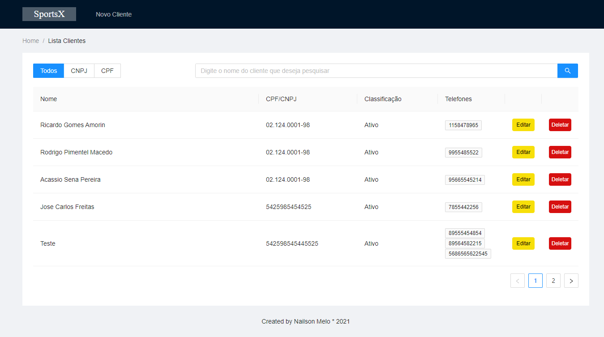
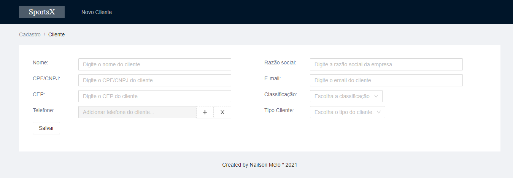
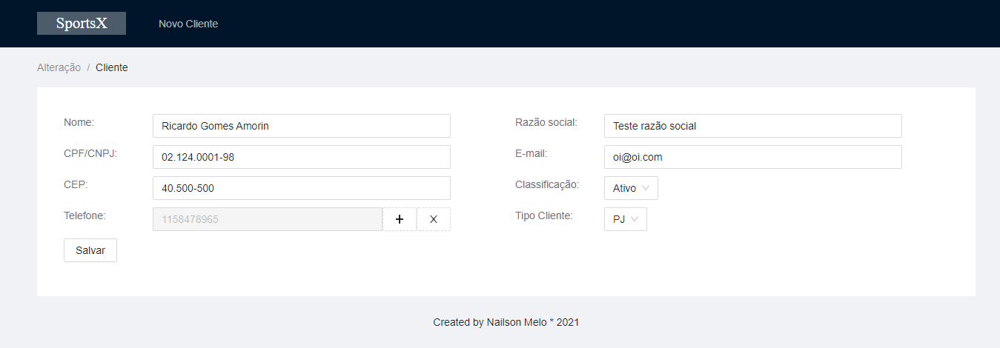
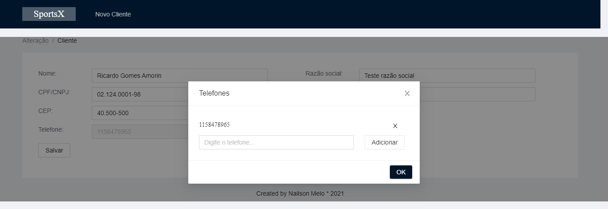
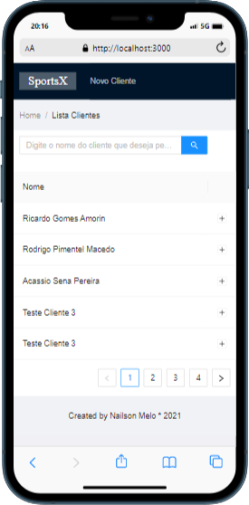
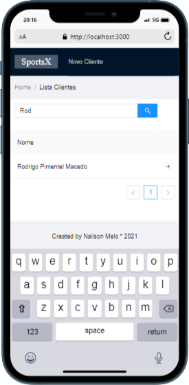
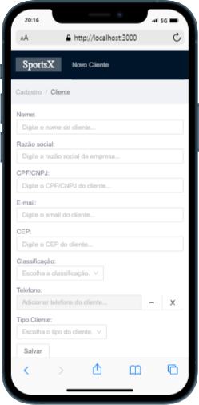
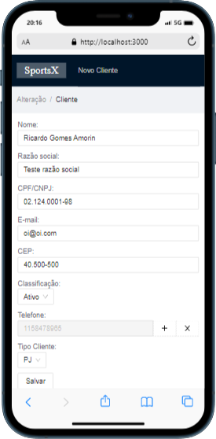
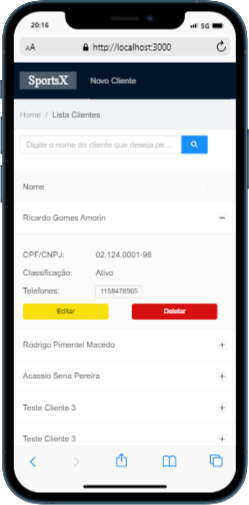

## *** SportsX ***

### O que foi usado para implementação?

| Backend                                           |           Frontend                               |
| -------------------                               | -------------------                              |
|  - [Node.js](https://nodejs.org/en/)              |  - [React.js](https://reactjs.org)               |
|  - [JavaScript](https://developer.mozilla.org/pt-BR/docs/Web/JavaScript)  |  - [JavaScript](https://developer.mozilla.org/pt-BR/docs/Web/JavaScript) |  
|  - [Sequelize](https://sequelize.org/)                     | - [AntD](https://ant.design/)              | 
|  - [SQLServer](https://www.microsoft.com/pt-br/sql-server/sql-server-2019)    | - [Axios](https://axios-http.com/docs/intro)   
|  - [Express](https://expressjs.com/pt-br/)    |             | 
|  - [Tedious](https://tediousjs.github.io/tedious/)    |   

## Screens Web
| | | 
|:-------------------------:|:-------------------------:|
|  Home |   Cadastro |
| Alteração| Adicionar telefone |

## Screens web mobile
| | | |
|:-------------------------:|:-------------------------:|:-------------------------:|
|   Home |   Home Pesquisa | 
|   Cadastro |   Alteração |   Home Expandido | 

## Configuração básica
||
|:-------------------------:|
### Front
Para executar a demonstração do front: clone repo e `cd frontend` em seguinda rode a aplicação com o comando `npm install || yarn install && npm start || yarn start`
e abra `http://localhost:3000` no navegador.
### Back
Para executar o backend `cd backend` em seguinda rode a aplicação com o comando `npm install && node server.js`

| | | |
|:-------------------------:|:-------------------------:|:-------------------------:|

## ATENÇÃO

Você precisará anexar os arquivos sportsx.mdf e sportsx_log.ldf no SQLServer, talvez precise dar permissões de acesso.
Siga a documentação da <strong><a href="https://docs.microsoft.com/pt-br/sql/relational-databases/databases/attach-a-database?view=sql-server-ver15">[Microsoft]</a></strong>

